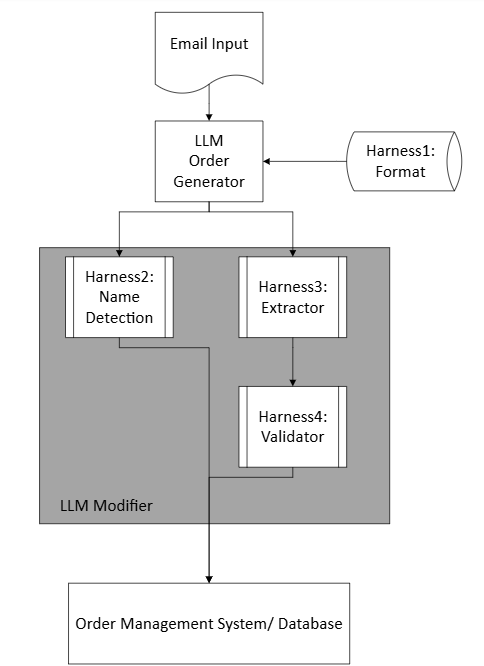

# Project Overview
# Background:
Assume that a B2B company will receive email order. In this project, we try to help the sales team to extract the the order required information and verify the information correctness, and then we will export the result via json format to send the data to Order Management System, Database or csv for daily order operation.

# Proposed Workflow:
See Workflow.png

### LLM:
-> Retrieval -> Scan Order -> Draft order (json) -> Modifier -> Verified order ->
Retrieval: Format, Status list, product list
Modifier: Modify First Draft output with validator

Harness:
1. Output Format
2. Order Verifier: 
2.1: Name detection
2.2: Extractor
2.3: Validator

Test Procedure:
1. Baseline
2. Baseline + Format
3. Baseline + Name detection
4. Baseline + Extractor
5. Baseline + Validator

Expected Output:
1. follow the structure of general_information.formatting.py
2. product_name should be in English

